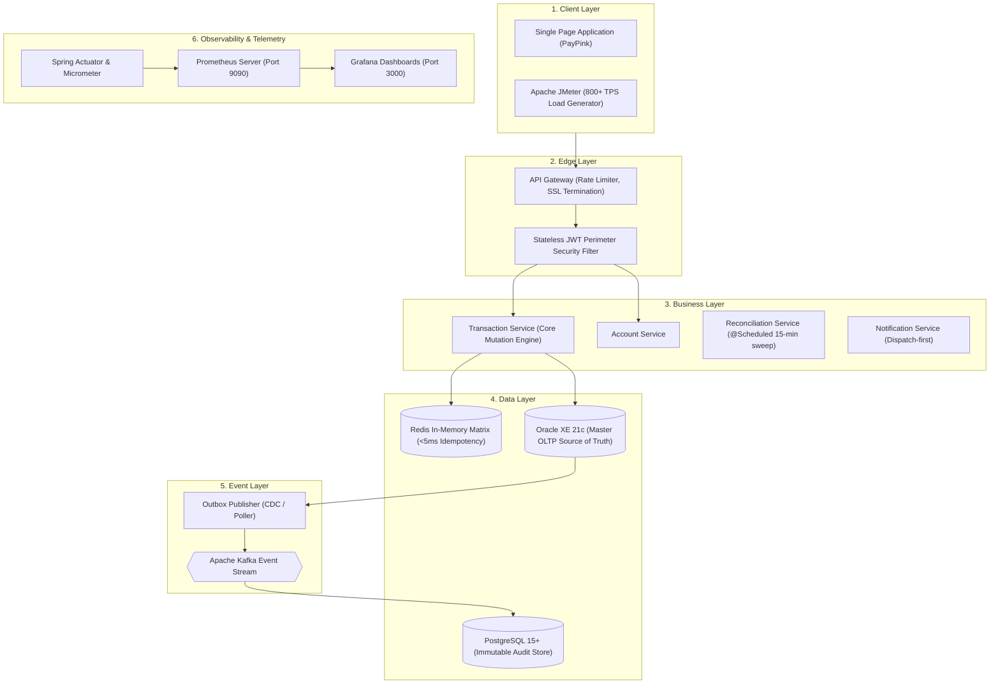

# System Architecture & Technical Specifications

## Capstone FSE: Core Retail Ledger & Balance Mutation Engine

### 1. Executive Summary & Design Rationale
The **Core Retail Ledger & Balance Mutation Engine** (PayPink) is a high-throughput, banking-grade financial ledger platform designed for high-concurrency balance mutations, distributed in-memory validation, and asynchronous audit trail propagation.

---

### 2. 6-Layer Architecture Breakdown

---

### 3. Database Topology (Dual-Store Strategy)

| Database Store | Tables Hosted | Primary Purpose |
| :--- | :--- | :--- |
| **Oracle XE 21c** | `CUSTOMER`, `ACCOUNT`, `TRANSACTION`, `OUTBOX_EVENT`, `AUDIT_LOG` | **Master OLTP & Security Engine**: Dedicated to low-latency balance mutations with `@Lock(LockModeType.PESSIMISTIC_WRITE)`, single local ACID commits, and synchronous security auditing. |
| **PostgreSQL 15+** | `LEDGER_MUTATION_AUDIT`, `RECONCILIATION_LOG`, `NOTIFICATION` | **Immutable Audit & Downstream Store**: Append-only double-entry financial audit entries, cross-database drift logs, and customer notification histories. |
| **Redis** | `idempotency:{key}` | In-memory distributed token validation matrix achieving **$\le 5\text{ms}$** operational turnaround. |

---

### 4. 11-Step Event Lifecycle

1. **Client Submits Transfer**: Client submits transfer payload with JWT Bearer and `Idempotency-Key` header.
2. **Transaction Service Validates Request**: JSR-380 perimeter checks (`@Digits(integer=14, fraction=4)`, `@Positive`) intercepted via RFC-7807 Global Exception Handler.
3. **Redis Idempotency Check**: Redis matrix verifies key in $<5\text{ms}$. If duplicate, cached response is returned with zero duplicate ledger deduction.
4. **Oracle ACID Transaction**:
   - Acquires `@Lock(LockModeType.PESSIMISTIC_WRITE)` (`SELECT ... FOR UPDATE`).
   - Validates balance $\ge$ mutation amount and currency compatibility.
   - Updates `ACCOUNT` balance.
   - Inserts `TRANSACTION` record.
   - Inserts synchronous `AUDIT_LOG` entry.
   - Inserts `OUTBOX_EVENT` (`status = 'PENDING'`).
5. **Local Commit**: Oracle XE commits all 4 operations atomically.
6. **Outbox Publisher Reads Event**: Background poller retrieves pending outbox records.
7. **Publish to Kafka**: Streams payload to Kafka topics (`transaction-events`, `audit-events`).
8. **Kafka Consumers Process Event**: Decoupled consumer groups process events asynchronously.
9. **Audit Service Appends to PostgreSQL**: Inserts into `LEDGER_MUTATION_AUDIT` (`before_balance`, `after_balance`, `DEBIT`/`CREDIT`).
10. **Reconciliation Service Validates**: Near-real-time validation and `@Scheduled(cron = "0 */15 * * * *")` 15-minute sweep logs to `RECONCILIATION_LOG`.
11. **Notification Service Dispatches Alert**: Dispatches SMS/Email alert first, then persists delivery status (`SENT`, `FAILED`, `RETRY`) into PostgreSQL `NOTIFICATION`.

---

### 5. Non-Functional Performance SLAs (NFRs)
- **Throughput**: $\ge 800\text{ TPS}$ peak concurrent velocity.
- **Latency SLA**: P95 $\le 50\text{ms}$ under peak concurrent execution.
- **Redis Turnaround**: $\le 5\text{ms}$ per token/idempotency check.
- **HikariCP Isolation**: `maximum-pool-size=30`, `minimum-idle=5`.
